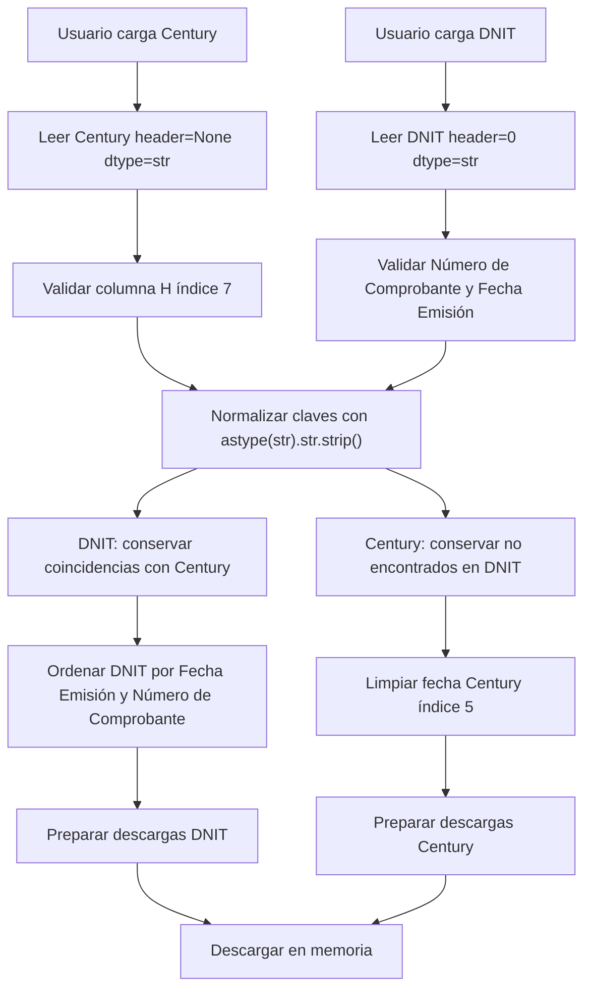

# Reporte Técnico y Funcional

# Módulo de Conciliación Automática: Century vs DNIT

## 1. Resumen Ejecutivo

El módulo **Century vs DNIT** es una herramienta web desarrollada en **Streamlit** para automatizar la conciliación de reportes de compras entre el sistema interno **Century** y los comprobantes oficiales provenientes de la **DNIT**.

Su objetivo principal es asistir al área administrativa, contable o fiscal en la identificación de registros coincidentes y no coincidentes entre ambas fuentes, reduciendo tareas manuales, errores de comparación y riesgos de reprocesamiento.

El módulo permite:

- Cargar archivos de Century y DNIT en formatos `.csv`, `.xlsx` y `.xls`.
- Comparar automáticamente números de factura/comprobante.
- Separar registros coincidentes y registros únicos.
- Descargar resultados en el mismo formato del archivo original.
- Descargar resultados alternativos en formatos compatibles.
- Convertir archivos tabulares entre formatos desde una sección independiente.
- Preservar identificadores fiscales como texto para evitar pérdida de ceros iniciales.

Todo el procesamiento se ejecuta **en memoria**, sin guardar archivos sensibles en disco.

## 2. Propósito del Módulo

El módulo está diseñado para procesos de **auditoría fiscal y conciliación de compras del periodo**.

En términos prácticos, responde a dos preguntas operativas:

| Pregunta | Respuesta generada por el módulo |
|---|---|
| ¿Qué comprobantes de DNIT ya están registrados en Century? | Archivo DNIT filtrado con registros coincidentes. |
| ¿Qué registros de Century no aparecen en DNIT? | Archivo Century filtrado sin duplicados. |

La herramienta evita que el operador tenga que realizar cruces manuales en Excel, copiar columnas o aplicar filtros manualmente.

## 3. Tecnologías Utilizadas

| Tecnología | Uso dentro del módulo |
|---|---|
| **Streamlit** | Interfaz web, carga de archivos, métricas y botones de descarga. |
| **Pandas** | Lectura, normalización, comparación y exportación de datos. |
| **openpyxl** | Lectura/escritura de archivos `.xlsx`. |
| **xlrd** | Lectura de archivos `.xls`. |
| **xlwt** | Escritura de archivos `.xls`. |
| **BytesIO** | Generación de archivos Excel en memoria. |

El módulo se encuentra implementado en:

```text
src/conciliacion_processor.py
```

La página Streamlit que lo expone se encuentra en:

```text
pages/Conciliacion_Century_DNIT.py
```

## 4. Flujo General de Uso

### 4.1 Carga del archivo Century

El operador debe cargar el archivo de compras generado desde Century en el campo:

```text
Archivo de Century
```

Formatos aceptados:

- `.csv`
- `.xlsx`
- `.xls`

Century se lee **sin encabezados**, usando:

```python
header=None
```

Esto significa que la primera fila del archivo se considera una fila de datos real.

### 4.2 Carga del archivo DNIT

El operador debe cargar el archivo oficial de DNIT en el campo:

```text
Archivo de la DNIT
```

Formatos aceptados:

- `.csv`
- `.xlsx`
- `.xls`

DNIT se lee **con encabezados**, usando:

```python
header=0
```

El sistema espera encontrar las columnas:

```text
Número de Comprobante
Fecha Emisión
```

### 4.3 Ejecución automática del cruce

Cuando ambos archivos están cargados, el módulo ejecuta automáticamente:

1. Lectura de ambos archivos.
2. Validación de estructura.
3. Normalización de claves.
4. Cruce de datos.
5. Cálculo de métricas.
6. Preparación de descargas.

### 4.4 Interpretación de métricas

Luego del procesamiento, se muestran tres métricas:

| Métrica | Descripción |
|---|---|
| **Total Coincidentes** | Cantidad de comprobantes DNIT encontrados también en Century. |
| **Únicos de Century** | Cantidad de registros de Century que no aparecen en DNIT. |
| **Eficiencia del Cruce** | Porcentaje de comprobantes DNIT coincidentes respecto al total DNIT. |

La eficiencia se calcula así:

```python
eficiencia = total_coincidentes / total_dnit * 100
```

Si DNIT está vacío, la eficiencia se muestra como `0` para evitar división por cero.

## 5. Criterios de Lectura e Ingesta

El módulo centraliza la lectura en la función:

```python
_leer_archivo_subido(uploaded_file, *, header)
```

Esta función detecta la extensión del archivo y utiliza el lector correcto.

| Extensión | Método Pandas | Motor | Preserva texto |
|---|---|---|---|
| `.csv` | `pd.read_csv()` | Nativo Pandas | Sí, con `dtype=str`. |
| `.xlsx` | `pd.read_excel()` | `openpyxl` | Sí, con `dtype=str`. |
| `.xls` | `pd.read_excel()` | `xlrd` | Sí, con `dtype=str`. |

Antes de leer, el módulo ejecuta:

```python
uploaded_file.seek(0)
```

Esto reinicia el puntero del archivo subido y evita errores cuando Streamlit intenta reutilizar el mismo archivo en otra operación, por ejemplo en el convertidor.

## 6. Preservación de Datos Fiscales

La preservación de datos fiscales es una regla crítica del módulo.

Todas las lecturas se hacen con:

```python
dtype=str
```

Esto evita que Pandas transforme valores sensibles como:

- RUCs.
- Timbrados.
- CDC de 44 dígitos.
- Números de comprobante.
- Números de factura.
- Identificadores con ceros iniciales.

Ejemplo de riesgo evitado:

| Valor original | Riesgo sin `dtype=str` | Resultado esperado |
|---|---|---|
| `001-001-0001234` | Alteración de formato. | `001-001-0001234` |
| `0123456789` | Pérdida del cero inicial. | `0123456789` |
| CDC largo | Notación científica. | Texto completo intacto. |

La normalización de claves es deliberadamente mínima:

```python
serie.astype(str).str.strip()
```

No se aplican cambios agresivos, comparación difusa ni transformación de guiones o ceros.

## 7. Reglas de Negocio de Conciliación

### 7.1 Regla para Century

Century:

- No tiene encabezados.
- Usa como clave la columna H.
- En Pandas, la columna H corresponde al índice `7`.

Constante implementada:

```python
CENTURY_FACTURA_INDEX = 7
```

El sistema valida que el archivo tenga al menos 8 columnas. Si no las tiene, muestra un error controlado.

### 7.2 Regla para DNIT

DNIT:

- Tiene encabezados.
- Usa como clave la columna exacta:

```text
Número de Comprobante
```

También requiere:

```text
Fecha Emisión
```

La fecha se usa para ordenar el resultado final de DNIT.

### 7.3 Resultado DNIT

Para DNIT, el módulo conserva únicamente los comprobantes que existen en Century.

Lógica:

```python
df_dnit_filtrado = df_dnit[dnit_keys.isin(century_key_set)].copy()
```

Luego ordena por:

1. `Fecha Emisión`
2. `Número de Comprobante`

La fecha se convierte temporalmente con:

```python
pd.to_datetime(..., errors="coerce")
```

La columna temporal de ordenamiento se elimina antes de exportar.

### 7.4 Resultado Century

Para Century, el módulo aplica la regla inversa: conserva únicamente registros cuya factura no aparece en DNIT.

Lógica:

```python
df_century_filtrado = df_century[~century_keys.isin(dnit_key_set)].copy()
```

Además, si existe la columna índice `5`, limpia la fecha para dejar solo los primeros 10 caracteres:

```python
df_century_filtrado[5] = df_century_filtrado[5].astype(str).str.slice(0, 10)
```

Esto evita que Century reciba fechas con marcas de tiempo como:

```text
2026-07-10 00:00:00
```

Y las deja como:

```text
2026-07-10
```

## 8. Descargas de Resultados

El módulo ofrece dos grupos de descargas.

### 8.1 Descarga principal

La descarga principal conserva exactamente:

- El nombre del archivo original.
- La extensión/formato original.

Ejemplos:

| Archivo cargado | Archivo descargado |
|---|---|
| `COMPRAS_05-2026.xlsx` | `COMPRAS_05-2026.xlsx` |
| `80063608_202605_COMPRAS_440080_1.xlsx` | `80063608_202605_COMPRAS_440080_1.xlsx` |
| `compras.csv` | `compras.csv` |
| `reporte.xls` | `reporte.xls` |

La interfaz organiza las descargas en dos columnas:

| Columna | Contenido |
|---|---|
| **Century** | Descargas de Century depurado. |
| **DNIT** | Descargas de DNIT coincidente. |

### 8.2 Descargas alternativas

Además de la descarga principal, el sistema permite descargar formatos alternativos:

| Fuente | Alternativas |
|---|---|
| Century | `.txt`, `.xlsx` |
| DNIT | `.csv`, `.xlsx` |

En las alternativas, el módulo mantiene el nombre base y cambia solo la extensión.

Ejemplo:

```text
COMPRAS_05-2026.xlsx -> COMPRAS_05-2026.txt
```

## 9. Formatos de Exportación

### 9.1 CSV

Uso principal:

- DNIT alternativo.
- Convertidor de archivos.

Características:

- UTF-8.
- Sin índice.
- Con encabezados cuando corresponde.

### 9.2 TXT tabulado

Uso principal:

- Century alternativo.

Características:

- Separador `\t`.
- Sin encabezados.
- Sin índice.
- Compatible con estructuras planas de importación.

### 9.3 XLSX

Uso principal:

- Descarga principal si el archivo original era `.xlsx`.
- Descarga alternativa.
- Convertidor.

Características:

- Generado en memoria con `BytesIO`.
- Motor `openpyxl`.
- Celdas configuradas como texto con formato `@`.

### 9.4 XLS

Uso principal:

- Descarga principal si el archivo original era `.xls`.
- Convertidor si el usuario elige `.xls`.

Características:

- Generado con `xlwt`.
- Respeta límites históricos de Excel:
  - 65.536 filas.
  - 256 columnas.
- Si se supera ese límite, el sistema muestra un error y recomienda `.xlsx`.

## 10. Convertidor de Archivos

El módulo incluye una sección independiente:

```text
Convertidor de archivos
```

Permite:

- Cargar `.csv`, `.xlsx` o `.xls`.
- Indicar si el archivo tiene encabezados.
- Convertir a:
  - CSV
  - XLSX
  - XLS

El convertidor también:

- Lee todo como texto.
- No guarda archivos en disco.
- Mantiene el nombre base original.
- Cambia solo la extensión de salida.

Ejemplo:

```text
reporte_dnit.xlsx -> reporte_dnit.csv
```

## 11. Seguridad y Procesamiento en Memoria

El módulo está diseñado para trabajar con información fiscal y financiera sensible.

Por eso:

- No guarda archivos cargados en disco.
- No genera archivos temporales persistentes.
- No imprime contenido fiscal en consola.
- Usa `BytesIO` para generar Excel en memoria.
- Usa strings en memoria para CSV/TXT.
- Entrega resultados directamente por `st.download_button`.

Esto lo hace adecuado para entornos como Streamlit Cloud.

## 12. Manejo de Errores

El módulo muestra errores controlados cuando ocurre alguno de estos casos:

| Caso | Resultado |
|---|---|
| Archivo vacío | Mensaje indicando que no hay datos tabulares. |
| Formato no soportado | Solicita `.csv`, `.xlsx` o `.xls`. |
| Century con menos de 8 columnas | Indica que falta la columna H. |
| DNIT sin `Número de Comprobante` | Indica columna faltante. |
| DNIT sin `Fecha Emisión` | Indica columna faltante. |
| Dependencia faltante | Indica instalar `openpyxl`, `xlrd` o `xlwt`. |
| Archivo corrupto o extensión incorrecta | Muestra detalle técnico controlado. |

## 13. Arquitectura Interna

Funciones principales:

| Función | Responsabilidad |
|---|---|
| `_leer_archivo_subido()` | Lee CSV/XLSX/XLS en memoria. |
| `_normalizar_clave()` | Convierte claves a texto y elimina espacios laterales. |
| `_validar_estructura()` | Verifica columnas obligatorias. |
| `_procesar_conciliacion()` | Ejecuta reglas de cruce Century vs DNIT. |
| `_exportar_csv()` | Genera CSV en memoria. |
| `_exportar_txt_tabular()` | Genera TXT tabulado en memoria. |
| `_exportar_xlsx()` | Genera XLSX en memoria. |
| `_exportar_xls()` | Genera XLS en memoria. |
| `_render_descargas_conciliacion()` | Renderiza descargas organizadas por fuente. |
| `_convertir_archivo()` | Convierte archivos entre formatos. |
| `render_modulo_conciliacion()` | Renderiza la interfaz principal. |

## 14. Diagrama del Flujo



## 15. Conclusión

El módulo **Century vs DNIT** automatiza una tarea sensible y repetitiva de conciliación fiscal. Su diseño prioriza:

- Exactitud en la comparación.
- Preservación de formatos fiscales.
- Seguridad mediante procesamiento en memoria.
- Compatibilidad con múltiples formatos.
- Descargas ordenadas por fuente.
- Conservación del nombre original en la descarga principal.

La solución reduce intervención manual y mejora la trazabilidad del proceso administrativo-contable.
